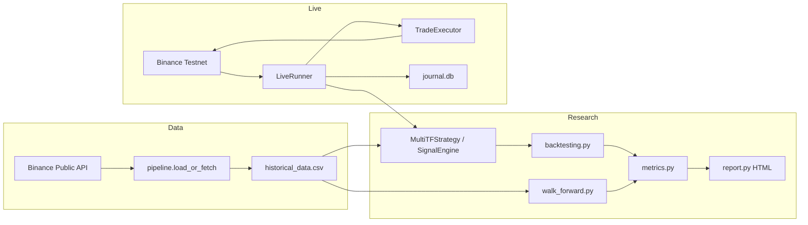

# Architecture

## Design Principles

1. **Single signal source** — `MultiTimeframeSignalEngine` is the only place entry/exit rules live.
2. **Thin adapters** — `MultiTFStrategy` (backtesting.py) and `LiveRunner` (testnet) only wire data in/out.
3. **Honest evaluation** — walk-forward OOS, benchmark comparison, full trade logs.
4. **Separation of concerns** — indicators, signals, risk, data, execution are independent modules.

## Data Flow



## Module Responsibilities

| Module | Role |
|--------|------|
| `src/quant/indicators.py` | Vectorized SMA, RSI, ATR |
| `src/quant/signals.py` | Multi-TF signal engine + context objects |
| `src/quant/risk.py` | Fixed-fractional sizing, daily loss limit |
| `src/data/pipeline.py` | Fetch, normalize, resample OHLCV |
| `src/backtesting/backtest.py` | Run backtest, save trades |
| `src/backtesting/metrics.py` | Sharpe, Sortino, Calmar, profit factor |
| `src/backtesting/walk_forward.py` | Rolling OOS windows |
| `src/backtesting/report.py` | Matplotlib equity/drawdown → HTML |
| `src/strategy/multi_tf.py` | Precomputed indicators for O(n) backtests |
| `src/trading/live_runner.py` | Polling loop, journal, risk checks |
| `src/storage/journal.py` | SQLite signals + trades |

## Multi-Timeframe Implementation

The 1h trend is **not** simulated by "every 4th bar." Instead:

1. 15m OHLCV is resampled to 1h (`open=first, high=max, low=min, close=last`).
2. SMA(20) and SMA(60) are computed on 1h closes.
3. Trend label (UP/DOWN/NEUTRAL) is forward-filled back to each 15m bar.

This ensures the higher timeframe filter is temporally correct and avoids look-ahead bias from improper alignment.

## Backtest Performance

Indicators are precomputed once in `MultiTFStrategy.init()` via `backtesting.py`'s `self.I()`. This avoids O(n²) recomputation on 50k+ bars.

## Walk-Forward Protocol

- **Train window:** 6 months (defines parameter context; fixed params in v1)
- **Test window:** 1 month (out-of-sample)
- **Step:** 1 month rolling
- **Output:** per-window return/trades + aggregate OOS metrics

## Live Execution

- Polls 15m klines every 60s
- Logs every signal evaluation to SQLite (including HOLD)
- Executes market orders on Testnet only
- Daily loss kill switch halts new entries at -3% equity

## Configuration

All parameters live in `config/config.py` as frozen dataclasses:

- `StrategyConfig` — indicator periods, risk limits
- `BacktestConfig` — cash, commission, slippage
- `WalkForwardConfig` — window sizes

## Testing

```
tests/test_indicators.py  — indicator correctness
tests/test_signals.py     — signal engine edge cases
tests/test_risk.py        — sizing and loss limits
tests/test_metrics.py     — performance metric math
```

CI runs on every push via `.github/workflows/ci.yml`.

## Known Limitations (say these in interviews)

1. **Strategy alpha** — current params underperform buy-and-hold in tested period.
2. **No limit/OCO orders** — live SL/TP are computed but exits are signal-driven.
3. **Single symbol** — BTCUSDT only; architecture supports extension.
4. **Polling, not websocket** — 60s loop, not event-driven streaming.
5. **No transaction cost model beyond flat commission** — slippage not simulated in backtest yet.

These are intentional scope boundaries, not oversights.
